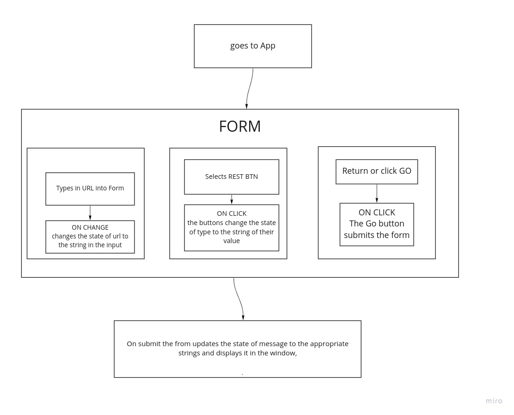

# LAB - Class 26

## Project: RESTy

### Author:  Matt Ravenmoore

### Links and Resources

- [ci/cd](https://github.com/ravenmoore-401-JS/resty/actions/new) (GitHub Actions)
- [front-end application]() (when applicable)
- [REPO](https://github.com/ravenmoore-401-JS/resty/)

### Setup

Go to site and use

#### `.env` requirements (where applicable)

#### How to initialize/run your application (where applicable)

- `npm start`

#### How to use your library (where applicable)

#### Tests

- How do you run tests?
- Any tests of note?
- Describe any tests that you did not complete, skipped, etc

#### UML

